### Ongoing repo

# HEM*Y*: Harmonic Equatorial Mount *Yourself*
## What the hell is this HEM*Y* thing?

HEMY (Harmonic Equatorial Mount *Yourself*) is an open-source harmonic equatorial mount for observation or astrophotography. It is based on the use of a harmonic reducer. The mount is designed to be inexpensive in relation to its performance, transportable, with a relatively large load capacity. Most importantly, this mount is easy to build: no need for machine tools or other laser-cutting-water-jet-plasma-turbo-piston-5-axis machines, you can order the CNC aluminium parts for less than 300€. A shopping list, a screwdriver, a saw and some resourcefulness: you've got everything you need to make an HEM*Y*. The ultimate aim is to distribute its design as an open-source product for personal use.

The technology used in this mount is similar to that used in robotics or industrial production lines. The main mechanical gearbox is a harmonic gearbox ([wikipedia](https://en.wikipedia.org/wiki/Strain_wave_gearing)). 

It can produce surprising results for an astronomical mount at first glance; the mount appears grossly undersized and unbalanced, whereas the whole assembly is extremely robust and stable, with enormous torque.
Conventional equatorial mounts require the use of counterweights. The aim of this development is to make available the design of a harmonic mount that can be built in your garage, with few tools or mechanical knowledge, for a price of less than 800€. Of course, the proud aim is to achieve performance equivalent to that of commercial harmonic reduction mounts.

The first results of the performance tests are up to my expectations for the moment. I hope this github repository can help you design or reproduce this equatorial mount. Please be patient, I'm only working on this project in my spare time. I'll update the testing progress on this readme. ✍️

## Support

Hey! Help me out for a couple of :beers: !

## What are the specifications

# Assembly

## Please read PDF drawings

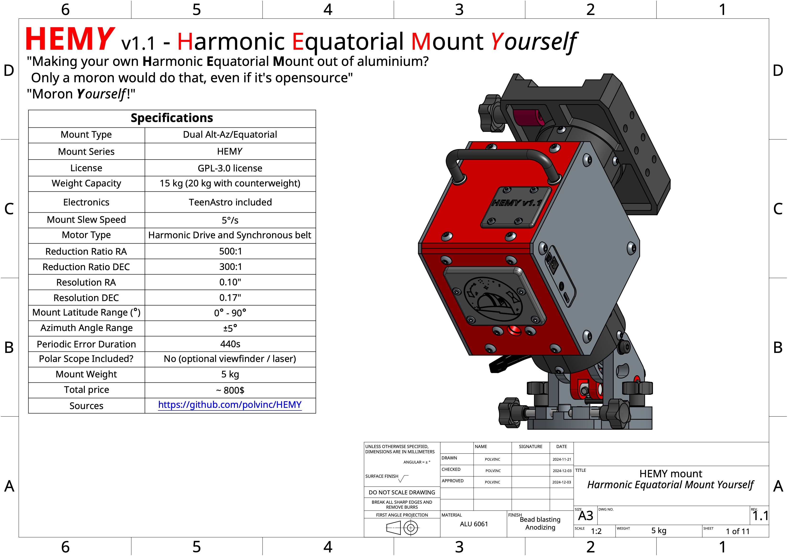

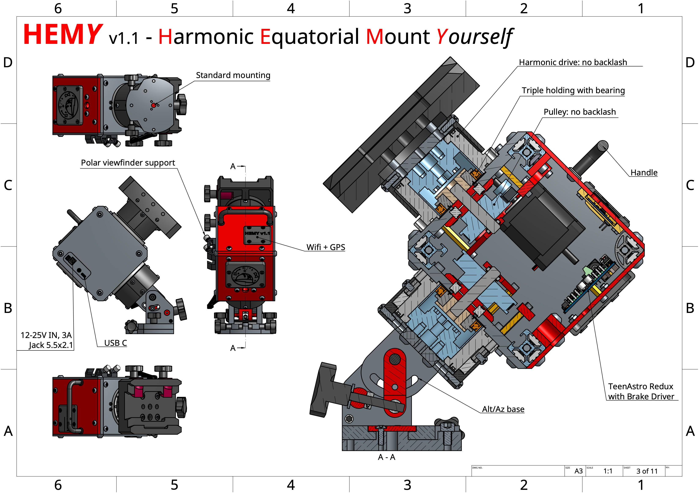
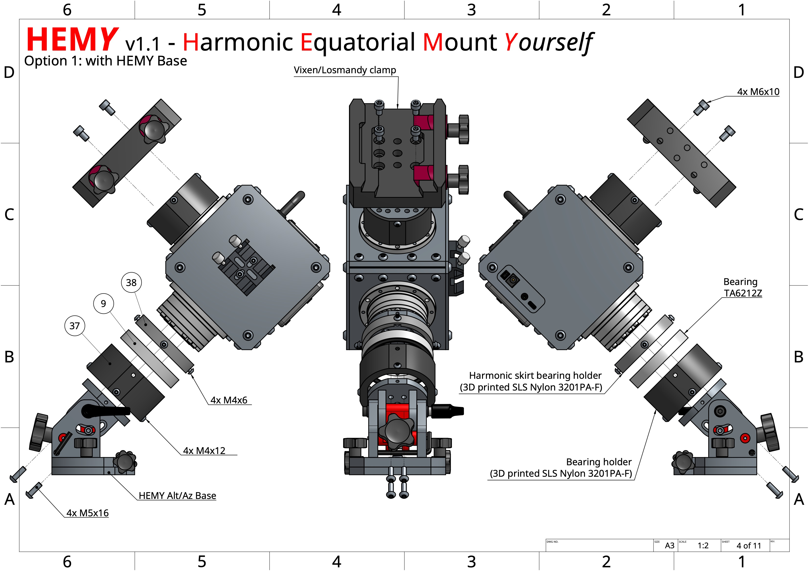

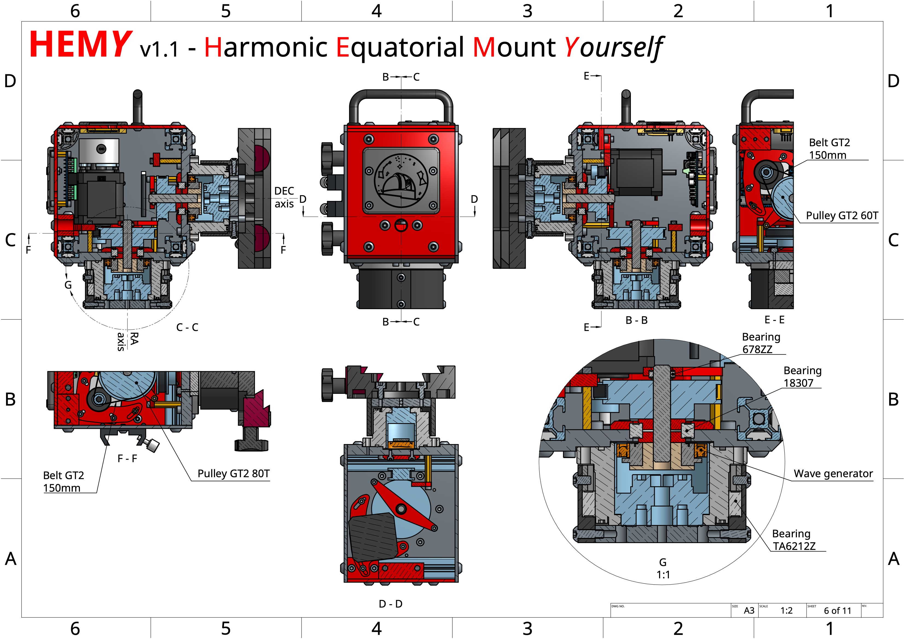

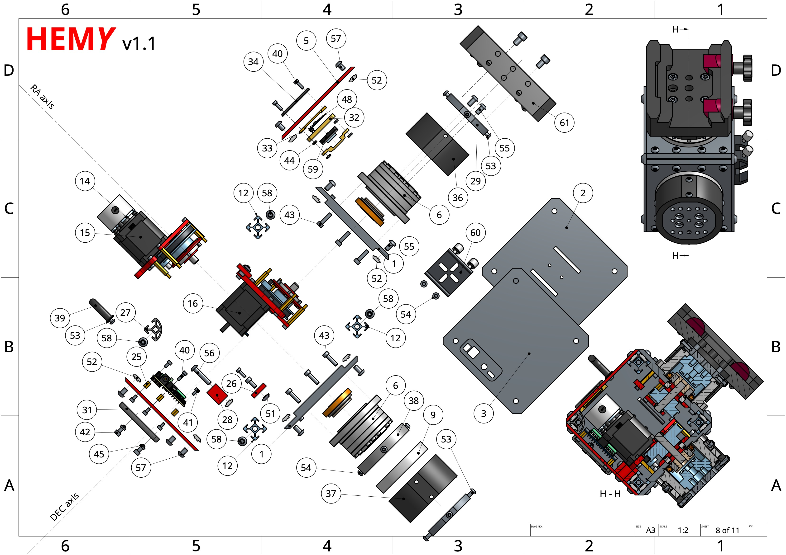
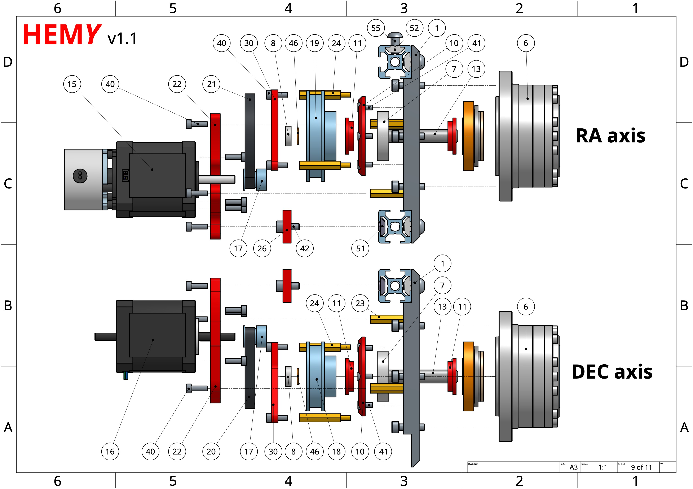
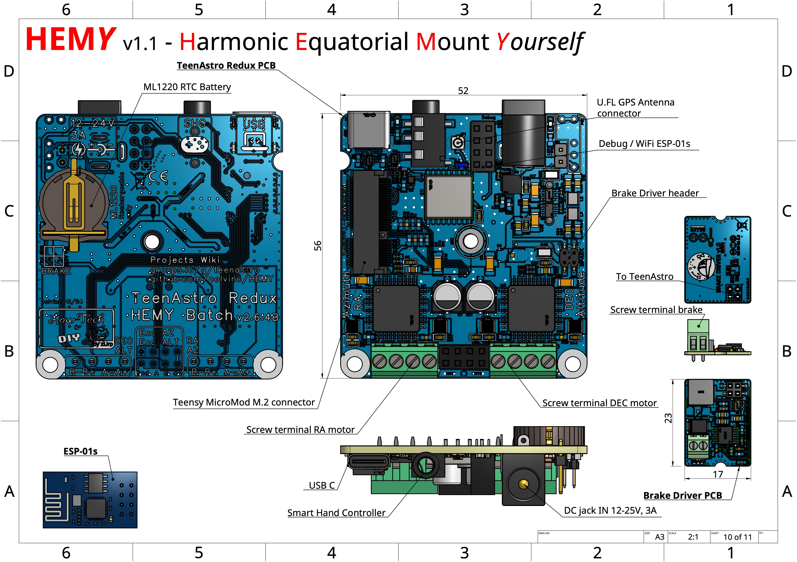
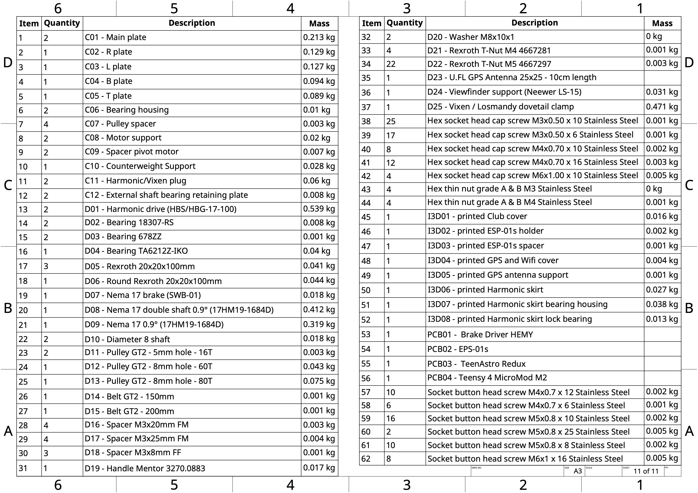

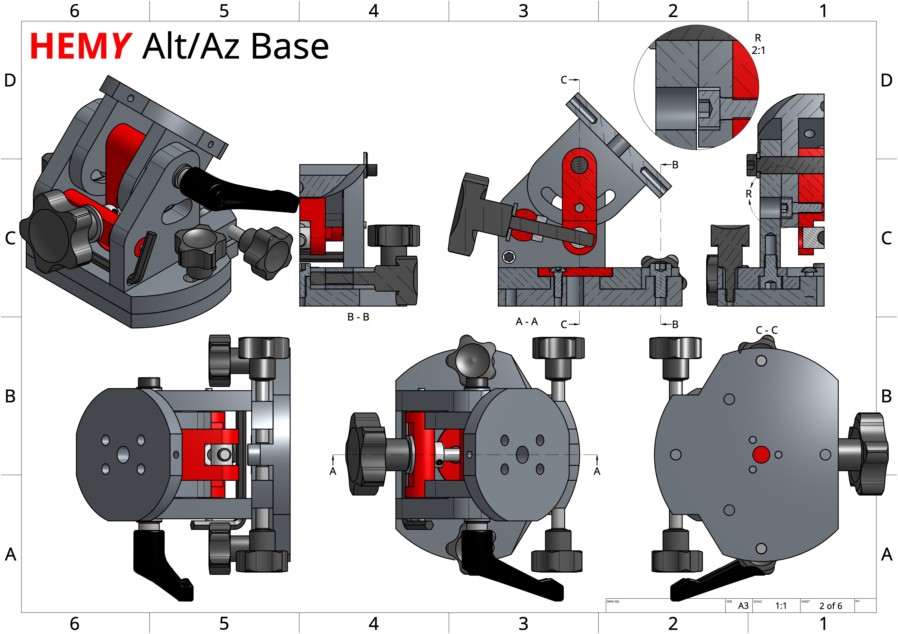
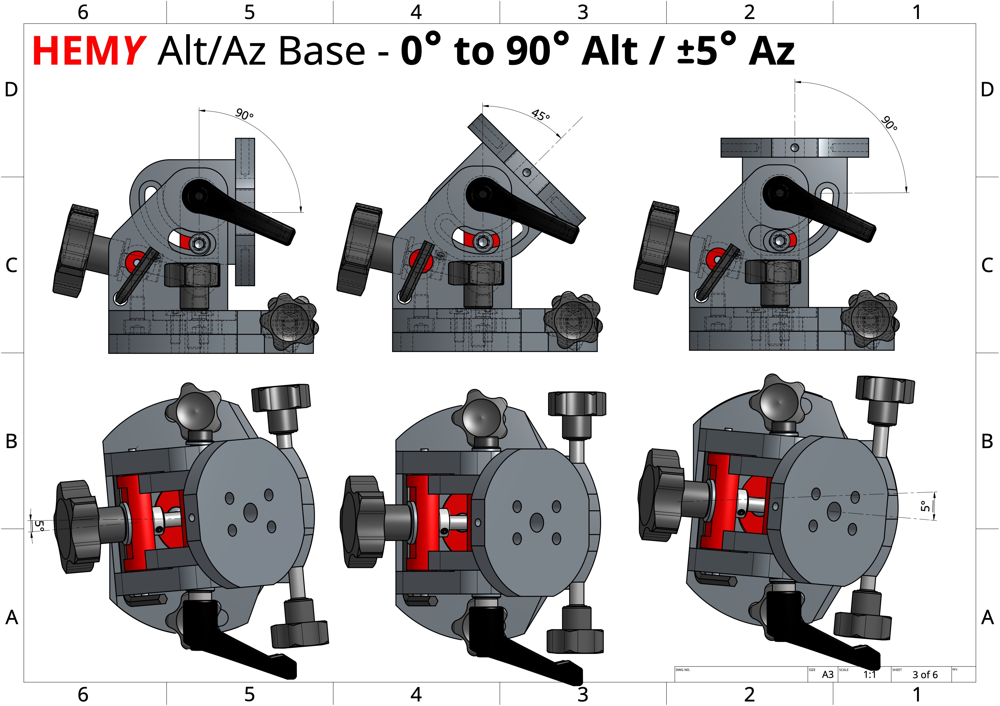
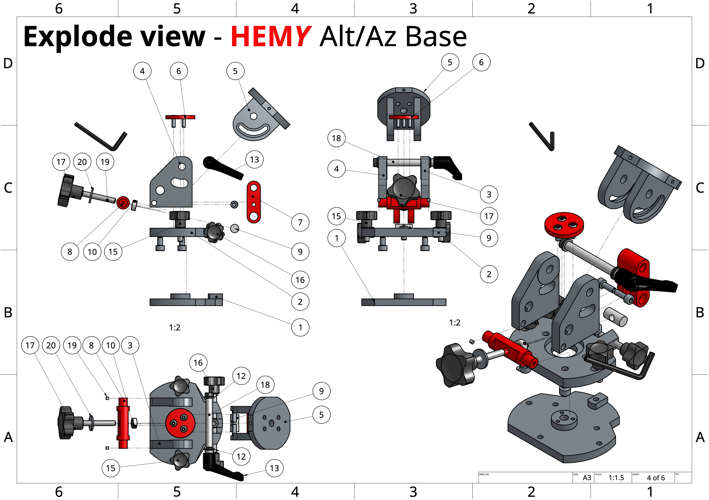
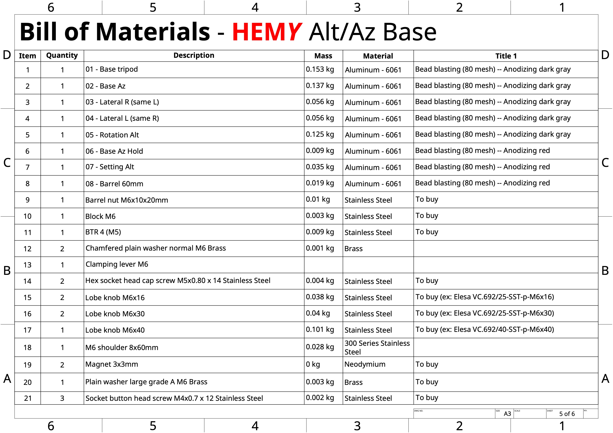
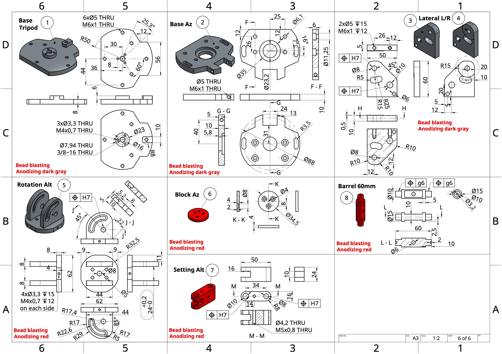

## Please watch STEP files
## BOM
| Name | Quantity | Reference | Price € | Total (€) | Link |
| -------- | -------- | -------- | -------- | -------- | -------- |
Washer M8x10x1 | 2 | M8x10x1 | 0,02 | 0,04 | [Aliexpress](https://www.aliexpress.com/item/1005006924477321.html)
Hex Brass Male Female | 4 | M3x20x6 FM | 0,2 | 0,8 | [Aliexpress](https://www.aliexpress.com/item/1005005462128073.html)
Hex Brass Male Female | 4 | M3x25x6 FM | 0,25 | 1 | [Aliexpress](https://www.aliexpress.com/item/1005005462128073.html)
Brass Standoffs Hex | 4 | M3x8 FF | 0,08 | 0,32 | [Aliexpress](https://www.aliexpress.com/item/1005006049595637.html)
Stainless Steel Cylindrical Locating Dowel | 2 | M8x45mm | 1,5 | 3 | [Aliexpress](https://www.aliexpress.com/item/1005007181161819.html)
TA6212Z 62x74x12 | 2 | TA6212Z 62x74x12 | 5 | 10 | [Aliexpress](https://www.aliexpress.com/item/1005006993881258.html)
Stainless Steel Adjusting Shim | 10 | M8x14xThick 100pcs, Thick 0.2mm | 0,02 | 0,2 | [Aliexpress](https://www.aliexpress.com/item/1005002374937009.html)
Hexagonal socket head cap screw | 1 | M6 shoulder dia 8mm, 60mm | 1,8 | 1,8 | [Aliexpress](https://www.aliexpress.com/item/1005006435736666.html)
Adjustable Handle Lever | 1 | M6 | 1,7 | 1,7 | [Aliexpress](https://www.aliexpress.com/item/4000304505877.html)
Fixing Ring | 1 | SOH6 6x12x6mm | 1 | 1 | [Aliexpress](https://www.aliexpress.com/item/1005004569679247.html)
Clamping knob | 1 | 54mm, M6 Screw Red Thumb | 3,2 | 3,2 | [Aliexpress](https://www.aliexpress.com/item/1005005273704474.html)
Clamping knob | 2 | M6, 16mm | 1,8 | 3,6 | [Aliexpress](https://www.aliexpress.com/item/1005004015129468.html)
Clamping knob | 2 | M6, 50mm | 1,9 | 3,8 | [Aliexpress](https://www.aliexpress.com/item/1005004015129468.html)
Barrel Bolts | 1 | M6x20 | 2 | 2 | [Aliexpress](https://www.aliexpress.com/item/1005005881148659.html)
Harmonic Drive | 2 | HBS-17, Reduction ratio 100 | 70 | 140 | [Aliexpress](https://www.aliexpress.com/item/1005007101363756.html)
20x20 Alu profile | 3 | 20x20x100mm | 3,5 | 10,5 | [Aliexpress](https://www.aliexpress.com/item/1005002537611699.html)
T-nuts | 20 |  T-nut 2020 M5  | 0,07 | 1,4 | [Aliexpress](https://www.aliexpress.com/item/32964780472.html)
T-nuts | 4 |  T-nut 2020 M4 | 0,05 | 0,2 | [Aliexpress](https://www.aliexpress.com/item/32964780472.html)
Bearing  | 2 |  18307RS  | 1 | 2 | [Aliexpress](https://www.aliexpress.com/item/1005006822711801.html)
20x20 Alu profile rounded | 1 | 2020R 20x20x100mm | 1 | 1 | [Aliexpress](https://www.aliexpress.com/item/1005004571007033.html)
Nema 17 0.9° double shaft | 2 | 17HS15-1584S-MG10  | 15 | 30 | [StepperOnline](https://www.omc-stepperonline.com/fr/biaxial-nema-17-bipolaire-0-9deg-44ncm-62-48oz-in-1-68a-2-8v-42x42x48mm-4-fils-17hm19-1684d)
Nema 17 brake | 1 | SWB-01 | 34 | 34 | [StepperOnline](https://www.omc-stepperonline.com/fr/dc-frein-electromagnetique-24v-0-25nm-35-4oz-in-pour-nema-17-moteur-pas-a-pas-swb-01)
CNC parts  | 18 |  -  | 330 HT  | 330 HT  |  [JLC3DP](https://jlcpcb.com/)
Electronics TeenAstro | 1 |  - | 50 HT | 50 HT |  [JLCPCB](https://jlcpcb.com/)

## Harmonic drive
Harmonic gearboxes ([wikipedia](https://en.wikipedia.org/wiki/Strain_wave_gearing)), or more precisely strain wave gears, are a type of gear mechanism that transmits much more torque than other common gears. This is mainly due to the fact that there are many more teeth engaged at once. One of the major advantages of these gears is that they have virtually no backlash, partly because they use deformation. It's a bit like belts, which are supposed to be more or less backlash-free, but harmonic gearboxes use deformable metal spring steels, which are much better than belts.

Put another way, in the case of an astronomical mount: they can drive much heavier loads without the need for counterweights, all with a very low self-weight!

The harmonic reducer model chosen [CSF-17-100-2UH](https://harmonicdrive.de/fileadmin/user_upload/Harmonic_Drive_Gears_EN_1050860_06_2022.pdf#page=50) is the same as [Alan](https://alanz.info/posts/2022/07/diy-mount/) DIY mount. You can find lots of them on ebay. This one has a reduction ratio of 1/100. It has the good fortune to meet my requirements, and to have been tested for another equatorial mount. Why deprive yourself? According to datasheet, it can handle more than 50Nm of torque and it also has a very comfortable permissible radial load of over 70Kg.
On AliExpress, you can find [HBS-17](https://fr.aliexpress.com/item/1005007101363756.html?gatewayAdapt=glo2fra), much cheaper.

  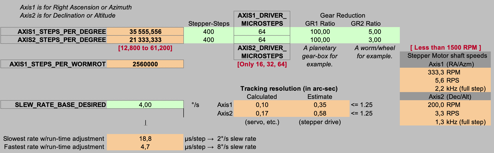

Using [OnStep's configurator spreadsheet](http://o.baheyeldin.com:1111), I chose to drive the harmonic gearbox with a belt/pulley couple, in order to achieve good tracking resolution, a good slew rate and a good number of steps/deg. The reduction ratio is 1/5 on RA, and 1/3 on DEC.
